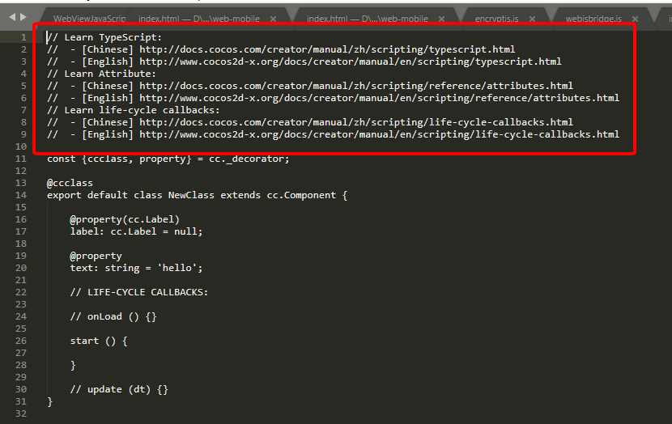
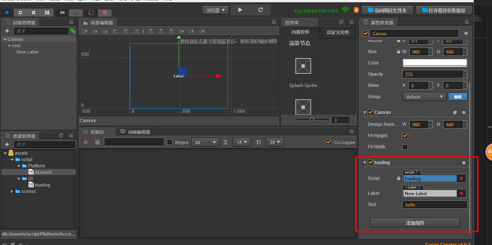

## cocos creator typescript 开发流程

# TypeScript 环境配置 

你如果想要你的ts有代码提示你需要做一些配置，前提是Cocos Creator和vs code你都安装好了，首先我们需要新建一个空白项目。

   
 
> 把这些都点击一遍
---

---

> 控制台会提示你安装完成

> 打开编辑器这时我们多了一个 为 creator.d.ts 的脚本 

creator 的提示都依靠这个脚本，引擎的api变动也要及时更新这个脚本，所以每次更新引擎的时候都要重新点击更新VS Code智能提示数据“来重新生成creator.d.ts。

右键点击资源管理器空白处新建一个ts脚本

新建脚本

用编辑器打开脚本后你会发现，脚本内容顶部有一些没用的东西

每次新建脚本都会带有这些东西，那我们要怎样去掉它呢?

首先我们要先打开编辑器目录

打开这个目录下的这个文件

> 删除不必要的注释并保存文件

这时我们新建脚本会发现，那些注释已经没了

最后挂载使用脚本

